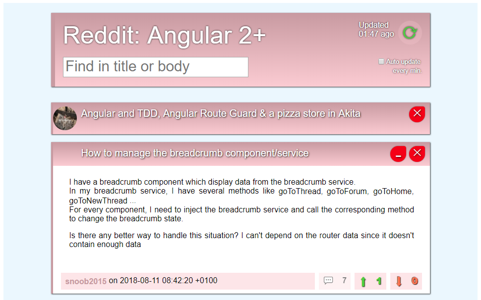

# RedditAngular

## Live version [here](https://jelitter.github.io/reddit-angular/)

 

## Local

1.  Clone this respository:

        git clone https://github.com/jelitter/reddit-angular.git

2.  Install dependencies:

        npm install

3.  Start local server:

        ng serve

4.  Or build for production:

        ng build --prod

 
 

---

_Isaac Sanchez, 2018_
